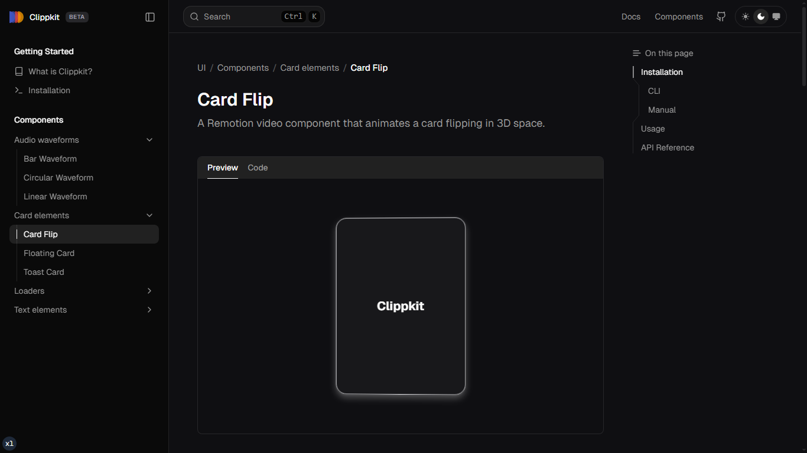
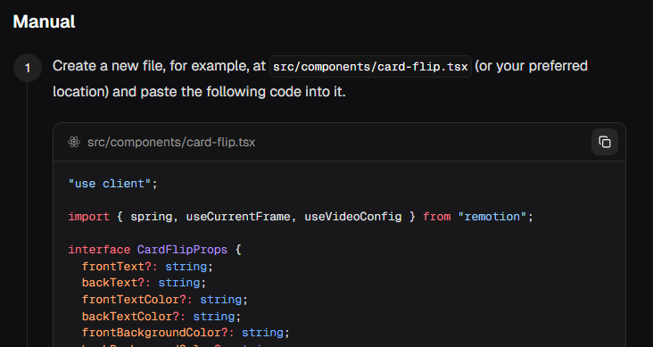

### What You’ll Need First

<Callout title="Requires a Remotion Project" type="warn">
  Clippkit components only work inside a Remotion setup. If you haven’t got one
  running yet, check out the [Remotion getting started
  guide](https://www.remotion.dev/docs/) first.
</Callout>

## Installation Methods

You can install Clippkit components in your Remotion project using one of the following methods:

-   **Using the `shadcn/ui` CLI**: This is the recommended method for most users. It allows you to easily add components to your project with a single command.
-   **Manual Installation**: If you prefer more control over the installation process, you can manually copy the component source code into your project.

### Using the `shadcn/ui` CLI

<Steps>
  <Step>
    ### Setup shadcn/ui CLI

    Clippkit utilizes the <code>shadcn/ui</code> CLI to make adding components to your project seamless. Because components are installed directly into your project, you have full control to modify them as needed.

    Refer to the [shadcn installation guide](https://ui.shadcn.com/docs/installation) to configure your project, or run the following command to initialize shadcn:

    ```package-install
    npx shadcn@latest init
    ```

  </Step>

  <Step>
    ### Configure Component Path (Optional)

    By default, components are installed in a `components` directory. You can customize the installation path by editing the `aliases.components` value in your `components.json` file:

    ```json title="components.json"
    {
      "aliases": {
        "components": "@/components/clippkit"
      }
    }
    ```

    This will install all Clippkit components to the `src/components/clippkit` directory.

  </Step>

  <Step>
  
    ### Add a Clippkit Components

    Once initialized, you can add any Clippkit component by providing its registry URL to the `add` command:

    ```package-install
    npx shadcn@latest add "https://clippkit.com/r/card-flip"
    ```

  </Step>

</Steps>

### Manual Installation

You can also manually install components by copying the source code from the Clippkit registry and adding it to your project.

<Steps>
  <Step>
    ### Find the component

    Find the component you want to install.
    
    

  </Step>

  <Step>
    ### Copy the source code

    Copy the source code for the component under the manual installation section.
    
    

  </Step>

  <Step>
    ### Create a new file

    Create a new file in your components directory (e.g., `src/components/clippkit/card-flip.tsx`).

  </Step>

  <Step>
    ### Paste the source code

    Paste the source code into the new file.

  </Step>

  <Step>
    ### Install any dependencies

    Install any dependencies that the component requires. You can find the dependencies on the component's page.

  </Step>

</Steps>

This approach is useful if you want to have more control over the installation process or if you want to install components in a project that doesn't use the `shadcn/ui` CLI.

---

## Next Steps

Once you've installed a component, you can:

1.  **Import it** in your Remotion composition.
2.  **Customize the props** to match your design.
3.  **Add it to your video timeline.**

Check out the individual component pages for detailed usage examples and API documentation.

---

## How Clippkit Works

Clippkit leverages the power of `shadcn/ui` to provide a seamless experience for adding components to your project. Here's a brief overview of the process:

1.  **Initialization**: When you run `npx shadcn@latest init`, it creates a `components.json` file in your project. This file contains configuration for `shadcn/ui`, including the path to your components folder.

2.  **Adding a Component**: When you run `npx shadcn@latest add <component-name>`, the `shadcn/ui` CLI reads your `components.json` file to determine where to install the new component.

3.  **Fetching from Registry**: The CLI then fetches the component's source code from the Clippkit registry. The registry is a collection of pre-built components that are ready to be used in your Remotion projects.

4.  **Adding to Your Project**: Finally, the CLI adds the component's source code directly to your project. This means you have full control over the code and can modify it to fit your needs.

This approach provides the following benefits:

-   **Full Control**: Since the components are added directly to your project, you can modify them as much as you want.
-   **No Dependencies**: Clippkit components are self-contained and don't add any extra dependencies to your project.
-   **Easy to Use**: The `shadcn/ui` CLI makes it easy to add and manage components in your project.

Here is a visual representation of the flow:

```
+---------------------+      +----------------------+      +---------------------+
|                     |      |                      |      |                     |
|   Your Project      |----->|  shadcn/ui CLI       |----->| Clippkit Registry   |
|                     |      |                      |      |                     |
+---------------------+      +----------------------+      +---------------------+
        ^                                                            |
        |                                                            |
        +------------------------------------------------------------+
        |
        |  Component source code is added to your project
        v
+---------------------+
|                     |
| Your Components     |
| Directory           |
|                     |
+---------------------+
```

